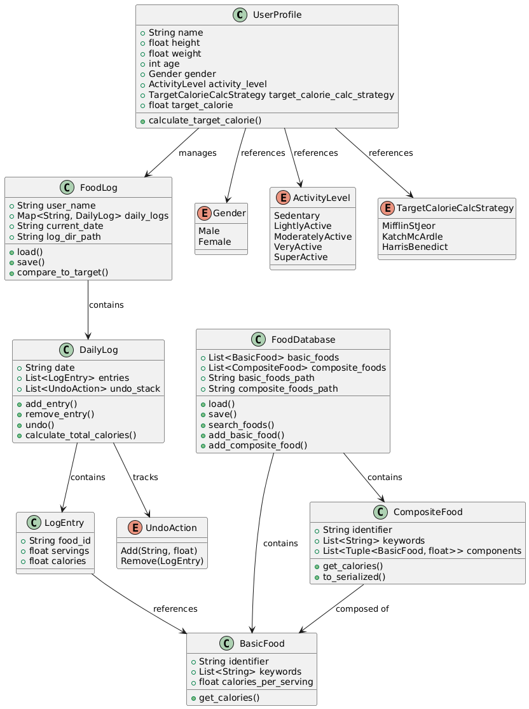

# DASS Assignment 3

## Product Design Document: YADA (Yet Another Diet Assistant)

**Date:** March 29, 2025 \
**Team Members:** 
Adithya Kishor (2023111019), Anirudh Sankar (2023111024),

---

### 1. Overview

YADA (Yet Another Diet Assistant) is a prototype software application designed to help users track their daily food consumption and manage dietary goals. The system allows users to maintain a database of basic and composite food items, log daily food intake, track calorie consumption against calculated targets, and manage their personal profile information relevant to diet planning. Key features include:

*   **Food Database:** Management of basic foods (name, keywords, calories) and composite foods (constructed from other foods). Persistence via text files. Ability to add new basic and composite foods.
*   **Daily Logging:** Recording food items consumed each day, including the number of servings. Logs are persistent and can be reviewed/updated for any date. Includes an indefinite undo feature for logging actions within a session.
*   **Diet Goal Profile:** Stores user information (gender, height, age, weight, activity level) to calculate daily target calorie intake using selectable strategies.
*   **Reporting:** Calculates and displays total consumed calories, target calories, and the difference for any selected date.
*   **Extensibility:** Designed to facilitate the addition of new calorie calculation methods and new sources for food information with minimal system impact.
*   **Interface:** Primarily designed for a command-line interface (CLI), though the design does not preclude a graphical user interface (GUI).

---

### 2. UML Class Diagram

The following UML class diagram illustrates the main classes, their attributes, important methods, and relationships within the YADA system.

**Diagram Explanation:**

*   **`UserProfile`**: Represents the user, holding personal data relevant to calorie calculations (gender, height, etc.) and linking to their `FoodLog`. It directly implements the calorie calculation strategies (Mifflin-St Jeor, Katch-McArdle, Harris-Benedict) as an enumeration rather than using the Strategy pattern. The target calorie calculation is performed directly within the class.

*   **`FoodLog`**: Manages all daily logs for a specific user. It contains a HashMap of `DailyLog` objects indexed by date strings. It handles persistence of logs to YAML files and provides methods to compare actual vs. target calories.

*   **`DailyLog`**: Represents the food log for a specific date. It contains a collection of `LogEntry` objects and implements an undo stack using the `UndoAction` enumeration. It manages adding/removing entries, calculating total calories for the day, and handling undo actions.

*   **`LogEntry`**: Represents a single entry in a `DailyLog`, containing the food ID, number of servings, and pre-calculated calories. It references a `BasicFood` rather than using the abstract `FoodItem` interface.

*   **`FoodDatabase`**: Manages the collection of `BasicFood` and `CompositeFood` items. It handles loading/saving from YAML files and provides search capabilities. The database is split into two separate files for basic and composite foods.

*   **`BasicFood`**: Represents a simple food item with a defined `calories_per_serving`. It directly implements the calorie calculation method.

*   **`CompositeFood`**: Represents a food item composed of `BasicFood` items with quantities. It calculates calories by summing the calories of its components. The implementation uses a tuple of `(BasicFood, f64)` for components rather than the abstract `FoodItem` interface.

*   **`UndoAction`**: An enumeration that tracks the type of action (Add or Remove) for implementing the undo functionality in `DailyLog`.

*   **`Gender`, `ActivityLevel`, `TargetCalorieCalcStrategy`**: Enumerations that define the possible values for user profile attributes and calorie calculation strategies.

**Key Relationships:**

*   `UserProfile` has a one-to-one relationship with `FoodLog` (each user has one log manager).
*   `FoodLog` aggregates multiple `DailyLog` objects in a HashMap.
*   `DailyLog` aggregates multiple `LogEntry` objects and tracks `UndoAction`s.
*   `FoodDatabase` aggregates multiple `BasicFood` and `CompositeFood` objects.
*   `CompositeFood` aggregates multiple `BasicFood` objects with quantities.
*   `LogEntry` references a `BasicFood` by ID.
*   The Strategy pattern for calorie calculation has been simplified to an enumeration within `UserProfile`.

---

### 3. Key Interaction Scenarios (Sequence Diagrams)

The following sequence diagrams illustrate key interactions within the system:

**Scenario 1: Adding Basic Food**

.png>)

**Scenario 2: Creating Composite Food**

.png>)

**Scenario 4: Calculating Calorie Requirement**

.png>)

**Scenario 4: Creating/Loading Daily Logs**

.png>)

**Scenario 5: Undoing Actions in Daily Log**

.png>)

---

### 4. Design Rationale

The design aims to balance requirements like flexibility, maintainability, and efficiency, adhering to established object-oriented principles:

*   **Low Coupling:**
    *   The **Strategy Pattern** is implemented through the `TargetCalorieCalcStrategy` enumeration within `UserProfile`, which decouples the calorie calculation logic from the user profile data. New strategies can be added by extending the enumeration.
    *   The `FoodDatabase` encapsulates the loading and saving logic using YAML files, decoupling the rest of the system from the specifics of the file format.
    *   `DailyLog` interacts with `BasicFood` through ID references, reducing dependency on concrete food implementations for calorie lookups within a `LogEntry`.

*   **High Cohesion:**
    *   Classes have focused responsibilities: `UserProfile` manages user data and calorie calculations, `FoodDatabase` manages food definitions, `FoodLog` manages the collection of daily logs, `DailyLog` manages entries for a single day, `LogEntry` represents one specific food consumption instance, and `UndoAction` encapsulates undo operations.

*   **Separation of Concerns:**
    *   **Persistence:** Loading/saving logic is primarily contained within `FoodDatabase` and `FoodLog`, using YAML files and the serde crate for serialization.
    *   **Calculation Logic:** Calorie calculation for food items is handled within `BasicFood` and `CompositeFood`. Target calorie calculation is handled by the `UserProfile` class using the `TargetCalorieCalcStrategy` enumeration.
    *   **Data Management:** `FoodDatabase` handles the master list of foods, while `FoodLog` manages the temporal record of consumption through `DailyLog` objects.
    *   **User Interface:** The core logic is designed independently of the UI (CLI), promoting separation.

*   **Information Hiding:**
    *   The internal structure of `CompositeFood` (its components) is hidden, accessed via methods like `get_calories` and `to_serialized`.
    *   The details of file formats for database and logs are hidden within the respective load/save methods.
    *   The undo mechanism in `DailyLog` is encapsulated through the `UndoAction` enumeration.

*   **Law of Demeter:** The design generally attempts to follow LoD. For example, in calorie calculation, `UserProfile` directly implements the calculation strategies rather than delegating to separate strategy objects. Similarly, `DailyLog` manages `LogEntry` objects but asks a `LogEntry` for its calories, which in turn references a `BasicFood`. This chaining is sometimes necessary but kept localized.

*   **Extensibility:**
    *   **Calorie Strategies:** New calculation methods can be added by extending the `TargetCalorieCalcStrategy` enumeration.
    *   **Food Sources:** The design localizes food creation/loading within `FoodDatabase`. Adding a new source (e.g., a web API) could involve creating a new class/module that interacts with the API and uses the existing `add_basic_food` mechanism.
    *   **Undo Functionality:** The `UndoAction` enumeration can be extended to support new types of undoable actions.

*   **Efficiency:**
    *   The design addresses the potential size of log files by having `LogEntry` objects hold a reference to a food item by ID rather than duplicating the entire food item's data.
    *   The use of HashMap in `FoodLog` provides efficient lookup of daily logs by date.
    *   The undo stack in `DailyLog` only stores necessary information for reversing actions.

---

### 5. Design Reflection

*   **Strengths:**
    1.  **Flexibility via Patterns:** The use of the Strategy pattern for calorie calculations and the Composite pattern for food items makes the system flexible and extensible. Adding new calculation methods or complex food types is well-supported by the design.
    2.  **Clear Separation of Concerns:** Responsibilities are well-defined among classes (data management vs. calculation vs. logging), which enhances maintainability and understandability. The separation of persistence logic is also a strength.

*   **Weaknesses:**
    1.  **Undo Implementation Detail:** The class diagram doesn't explicitly show the mechanism for storing undo actions (e.g., a Command pattern implementation or Memento). While the sequence diagram shows the *effect* of undo, the underlying structure for managing the undo history in `DailyLog` needs further specification for implementation.
    2.  **Error Handling and Validation:** The diagrams focus on the "happy path" and do not detail how input validation (e.g., non-numeric calories, invalid dates) or file I/O errors are handled, which is crucial for a robust application. Explicit exception handling strategies are not depicted.

---