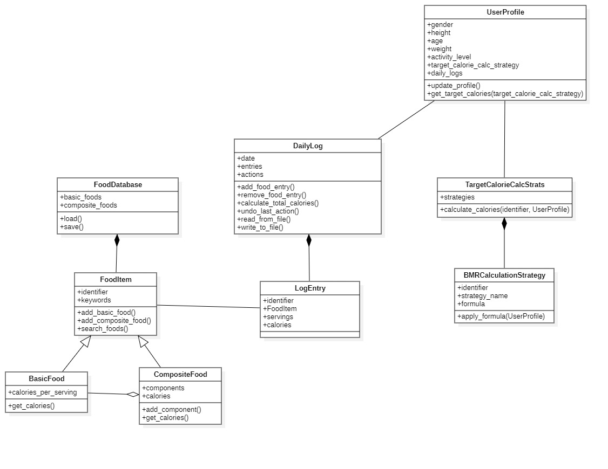

# DASS Assignment 3

## Product Design Document: YADA (Yet Another Diet Assistant)

**Date:** March 29, 2025 \
**Team Members:** 
Adithya Kishor (2023111019), Anirudh Sankar (2023111024),

---

### 1. Overview

YADA (Yet Another Diet Assistant) is a prototype software application designed to help users track their daily food consumption and manage dietary goals. The system allows users to maintain a database of basic and composite food items, log daily food intake, track calorie consumption against calculated targets, and manage their personal profile information relevant to diet planning. Key features include:

*   **Food Database:** Management of basic foods (name, keywords, calories) and composite foods (constructed from other foods). Persistence via text files. Ability to add new basic and composite foods.
*   **Daily Logging:** Recording food items consumed each day, including the number of servings. Logs are persistent and can be reviewed/updated for any date. Includes an indefinite undo feature for logging actions within a session.
*   **Diet Goal Profile:** Stores user information (gender, height, age, weight, activity level) to calculate daily target calorie intake using selectable strategies.
*   **Reporting:** Calculates and displays total consumed calories, target calories, and the difference for any selected date.
*   **Extensibility:** Designed to facilitate the addition of new calorie calculation methods and new sources for food information with minimal system impact.
*   **Interface:** Primarily designed for a command-line interface (CLI), though the design does not preclude a graphical user interface (GUI).

---

### 2. UML Class Diagram

The following UML class diagram illustrates the main classes, their attributes, important methods, and relationships within the YADA system.

**Diagram Explanation:**

*   **`UserProfile`**: Represents the user, holding personal data relevant to calorie calculations (gender, height, etc.) and linking to their `DailyLog`s. It collaborates with `TargetCalorieCalcStrats` to determine the target daily calories based on a selected strategy.
*   **`DailyLog`**: Represents the food log for a specific date. It contains a collection of `LogEntry` objects. It manages adding/removing entries, calculating total calories for the day, handling undo actions, and persisting the log to a file.
*   **`LogEntry`**: Represents a single entry in a `DailyLog`, linking a specific `FoodItem` with the number of servings consumed and the calculated calories for that entry. It aggregates a `FoodItem`.
*   **`FoodDatabase`**: Manages the collection of all known `FoodItem`s (both `BasicFood` and `CompositeFood`). Responsible for loading/saving the food database from/to persistent storage (text files) and providing search capabilities. It aggregates `FoodItem`s.
*   **`FoodItem`**: An abstract base class (or interface) representing any food item. It defines common properties like an identifier and keywords. `BasicFood` and `CompositeFood` inherit from it. This structure supports the Composite pattern.
*   **`BasicFood`**: Represents a simple food item with a defined `calories_per_serving`.
*   **`CompositeFood`**: Represents a food item composed of other `FoodItem`s (basic or composite). Its calories are calculated by summing the calories of its components. It aggregates `FoodItem`s (its components). This implements the Composite pattern, allowing complex food structures.
*   **`TargetCalorieCalcStrats`**: Implements the Strategy pattern for calculating target daily calories. It holds a collection of available `BMRCalculationStrategy` objects and selects the appropriate one to perform the calculation based on user selection and `UserProfile` data.
*   **`BMRCalculationStrategy`**: Represents a specific algorithm/formula (e.g., Harris-Benedict, Mifflin-St Jeor) for calculating Basal Metabolic Rate (BMR) and, subsequently, target calories based on the `UserProfile`.

**Key Relationships:**

*   `UserProfile` has a one-to-many relationship with `DailyLog` (implicitly, though not drawn with cardinality, a user has multiple daily logs over time).
*   `DailyLog` aggregates multiple `LogEntry` objects.
*   `LogEntry` aggregates one `FoodItem`.
*   `FoodDatabase` aggregates multiple `FoodItem` objects.
*   `CompositeFood` aggregates multiple `FoodItem` objects (its components).
*   `TargetCalorieCalcStrats` aggregates multiple `BMRCalculationStrategy` objects.
*   Inheritance is used for `FoodItem` -> `BasicFood` and `FoodItem` -> `CompositeFood`.

---

### 3. Key Interaction Scenarios (Sequence Diagrams)

The following sequence diagrams illustrate key interactions within the system:

**Scenario 1: Adding Basic Food**

This diagram shows the process of adding a new basic food item to the database. It involves loading the database, creating the `BasicFood` object via the `FoodItem` interface (orchestrated likely by `FoodDatabase`), and saving the updated database.

**Scenario 2: Creating Composite Food**

This diagram illustrates how a user creates a composite food item. It involves loading the database, creating the `CompositeFood` object, adding its constituent components (which can be `BasicFood` or other `CompositeFood` items) potentially in a loop, calculating the total calories by summing component calories, and finally saving the database.

**Scenario 4: Calculating Calorie Requirement**

This diagram demonstrates how the system calculates the user's target daily calories. The `UserProfile` initiates the request, delegating to the `TargetCalorieCalcStrats` object. This object selects the appropriate `BMRCalculationStrategy` based on user preference or system default and invokes its `apply_formula` method, passing the `UserProfile` data. The calculated target calories are then returned.

**Scenario 4: Creating/Loading Daily Logs**

This diagram shows the initialization of a `DailyLog` for a day, either by reading existing entries from a file or starting fresh. It then loops through the process of adding new log entries, where each addition involves creating a `LogEntry`, associating it with a `FoodItem`, and calculating the calories for the entry based on servings and the `FoodItem`'s calories per serving. The log is saved eventually (e.g., on exit or user command).

**Scenario 5: Undoing Actions in Daily Log**

This diagram illustrates the undo functionality. When the user selects undo, the `DailyLog` retrieves the last action performed. Depending on whether the last action was adding or deleting an entry, the `DailyLog` either recreates the deleted `LogEntry` (fetching necessary data like calories from the `FoodItem`) or destroys the previously added `LogEntry`. This suggests an implementation using the Command pattern or storing a history of actions/states.

---

### 4. Design Rationale

The design aims to balance requirements like flexibility, maintainability, and efficiency, adhering to established object-oriented principles:

*   **Low Coupling:**
    *   The **Strategy Pattern** (`TargetCalorieCalcStrats`, `BMRCalculationStrategy`) decouples the `UserProfile` from the specific algorithms used for calorie calculation. New strategies can be added without modifying `UserProfile`.
    *   The `FoodDatabase` encapsulates the loading and saving logic, decoupling the rest of the system from the specifics of the file format(s).
    *   `DailyLog` interacts with `FoodItem` through its interface/abstract class, reducing dependency on concrete `BasicFood` or `CompositeFood` implementations for calorie lookups within a `LogEntry`.
*   **High Cohesion:**
    *   Classes have focused responsibilities: `UserProfile` manages user data, `FoodDatabase` manages food definitions, `DailyLog` manages entries for a single day, `LogEntry` represents one specific food consumption instance, `BMRCalculationStrategy` encapsulates a single calculation method.
*   **Separation of Concerns:**
    *   **Persistence:** Loading/saving logic is primarily contained within `FoodDatabase` and `DailyLog`.
    *   **Calculation Logic:** Calorie calculation for food items is handled within `BasicFood` and `CompositeFood`. Target calorie calculation is handled by the Strategy pattern implementation.
    *   **Data Management:** `FoodDatabase` handles the master list of foods, while `DailyLog` handles the temporal record of consumption.
    *   **User Interface:** The core logic is designed independently of the UI (assumed CLI), promoting separation.
*   **Information Hiding:**
    *   Class attributes are generally private (as implied by standard OO practice, though not explicitly shown with +/- in all diagrams), accessed via public methods, hiding internal representation.
    *   The internal structure of `CompositeFood` (its components) is hidden, accessed via methods like `add_component` and `get_calories`.
    *   The details of file formats for database and logs are hidden within the respective load/save methods.
*   **Law of Demeter:** The design generally attempts to follow LoD. For example, in `Calculating Calorie Requirement`, `UserProfile` calls `TargetCalorieCalcStrats`, which calls `BMRCalculationStrategy`. `UserProfile` doesn't directly call the specific strategy. Similarly, `DailyLog` manages `LogEntry` objects but might ask a `LogEntry` for its calories, which in turn asks its `FoodItem`. This chaining is sometimes necessary but kept localized.
*   **Extensibility:**
    *   **Calorie Strategies:** New `BMRCalculationStrategy` classes can be implemented and added to `TargetCalorieCalcStrats` without changing other parts of the system.
    *   **Food Sources:** While not explicitly detailed with an Adapter, the design localizes food creation/loading within `FoodDatabase`. Adding a new source (e.g., a web API) could involve creating a new class/module that interacts with the API and uses the existing `add_basic_food` mechanism within `FoodDatabase`, potentially requiring an interface for different data loaders.
*   **Efficiency (Log File Size Hint):** The design addresses the potential size of log files by having `LogEntry` objects hold a *reference* (via aggregation) to a `FoodItem` object rather than duplicating the entire food item's data within each log entry. This significantly reduces redundancy, especially for frequently logged foods. The `FoodItem` objects themselves are managed centrally by the `FoodDatabase`.

---

### 5. Design Reflection

*   **Strengths:**
    1.  **Flexibility via Patterns:** The use of the Strategy pattern for calorie calculations and the Composite pattern for food items makes the system flexible and extensible. Adding new calculation methods or complex food types is well-supported by the design.
    2.  **Clear Separation of Concerns:** Responsibilities are well-defined among classes (data management vs. calculation vs. logging), which enhances maintainability and understandability. The separation of persistence logic is also a strength.

*   **Weaknesses:**
    1.  **Undo Implementation Detail:** The class diagram doesn't explicitly show the mechanism for storing undo actions (e.g., a Command pattern implementation or Memento). While the sequence diagram shows the *effect* of undo, the underlying structure for managing the undo history in `DailyLog` needs further specification for implementation.
    2.  **Error Handling and Validation:** The diagrams focus on the "happy path" and do not detail how input validation (e.g., non-numeric calories, invalid dates) or file I/O errors are handled, which is crucial for a robust application. Explicit exception handling strategies are not depicted.

---